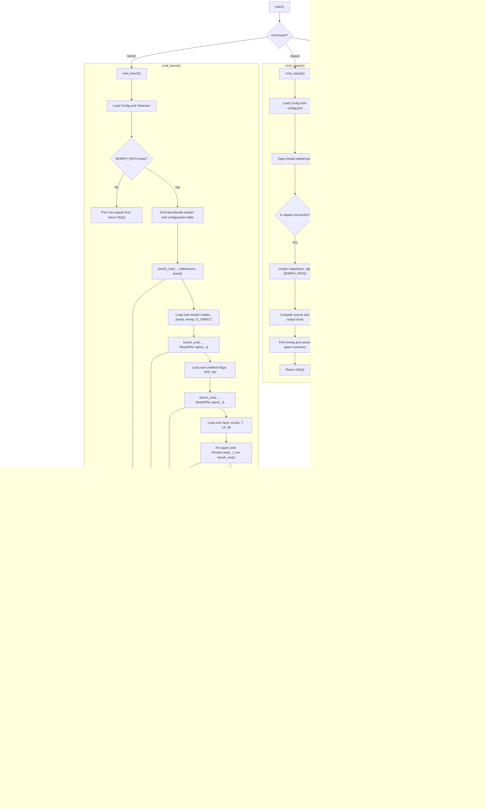

```mermaid

---
references:
  - "File: /morphogenesis-cli/src/main.rs"
generationTime: 2026-08-15T12:02:04.483Z
---
flowchart TD
    A["main()"] --> B{"Command?"}
    B -->|"repack"| C["cmd_repack()"]
    B -->|"bench"| D["cmd_bench()"]
    B -->|"run/default"| E["cmd_run(args)"]

    subgraph S1["cmd_repack()"]
        C --> C1["Load Config from config.json"]
        C1 --> C2["Open model.safetensors"]
        C2 --> C3{"Is repack successful?"}
        C3 -->|"Yes"| C4["morph::repack(src, cfg, MORPH_PATH)"]
        C4 --> C5["Compute source and output sizes"]
        C5 --> C6["Print timing and saved-space summary"]
        C6 --> C7["Return Ok(())"]
    end

    subgraph S2["cmd_run(args)"]
        E --> E1{"args.is_empty()?"}
        E1 -->|"Yes"| E2["prompt = 'The capital of France is'"]
        E1 -->|"No"| E3["prompt = args.join(' ')"]
        E2 --> E4["Load Tokenizer and Config"]
        E3 --> E4
        E4 --> E5{"MORPH_PATH exists?"}
        E5 -->|"Yes"| E6["weights = MorphFile::open(MORPH_PATH, Mode::Mmap)"]
        E5 -->|"No"| E7["weights = SafeTensors::open(model.safetensors)"]
        E6 --> E8["Print weights.describe()"]
        E7 --> E8
        E8 --> E9["model = Model::new(cfg, weights)"]
        E9 --> E10["tokens = tk.encode(prompt)"]
        E10 --> E11["Print prompt to stdout"]
        E11 --> E12["model.generate(tokens, 60, stop_tokens, closure)"]
        E12 --> E13{"For each generated token?"}
        E13 -->|"Yes"| E14["Decode token and print it"]
        E14 --> E15["count += 1"]
        E15 --> E13
        E13 -->|"No"| E16["Print final generation summary"]
        E16 --> E17["Return Ok(())"]
    end

    subgraph S3["cmd_bench()"]
        D --> D1["Load Config and Tokenizer"]
        D1 --> D2{"MORPH_PATH exists?"}
        D2 -->|"No"| D3["Print 'run repack first'; return Ok(())"]
        D2 -->|"Yes"| D4["Print benchmark header and configuration table"]
        D4 --> D5["bench_one(..., safetensors, pread)"]
        D5 --> D6["Loop over morph modes: pread, mmap, O_DIRECT"]
        D6 --> D7["bench_one(..., MorphFile::open(...))"]
        D7 --> D8["Loop over prefetch flags: OFF, ON"]
        D8 --> D9["bench_one(..., MorphFile::open(...))"]
        D9 --> D10["Loop over layer counts: 7, 14, 28"]
        D10 --> D11["Pin layers with Pinned::new(...); run bench_one()"]
        D11 --> D12["Return Ok(())"]
    end

    subgraph S4["bench_one(label, cfg, tokens, repeats, prefetch, cache_file, build)"]
        D5 --> B1["drop_cache(cache_file)"]
        D7 --> B1
        D9 --> B1
        D11 --> B1
        B1 --> B2["build() -> Arc<dyn Weights>"]
        B2 --> B3["w.reset_bytes()"]
        B3 --> B4["model = Model::new(cfg, w).with_prefetch(prefetch)"]
        B4 --> B5["kv = KvCache::new(...)"]
        B5 --> B6["Run model.forward(tokens, &mut kv)"]
        B6 --> B7["Record cold timing and bytes_read"]
        B7 --> B8["Create fresh kv cache"]
        B8 --> B9["Run model.forward(tokens, &mut kv) again"]
        B9 --> B10["Record warm timing"]
        B10 --> B11["Sort cold/warm timings and compute spread"]
        B11 --> B12["Print benchmark row"]
    end
```
